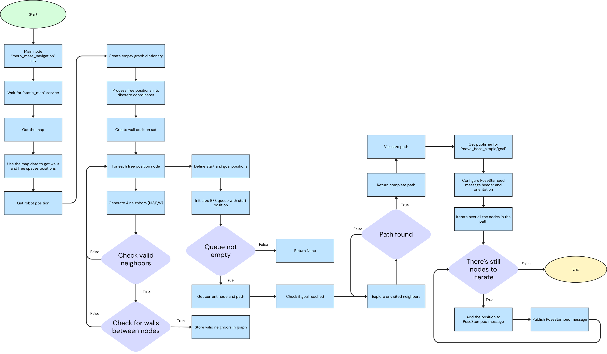

# Maze Escape Robot Documentation

## 👥 Group Members

- **Arthur Zhu**
- **Kyrylo Stepanets**

## Overview

The goal of this project is to develop ROS scripts in order to make an "autonomous" maze-solving robot. The robot is equipped with a laser scanner and utilizes a combination of map processing and search algorithms to navigate through the maze and reach the exit.

## Project Structure

The project consists of the following main files:

- `global_planning.py`: A Python script that handles global path planning and map processing. It retrieves the map from ROS, creates a graph representation of the environment, and uses Breadth-First Search (BFS) to find a path from the start to the goal position. It also includes visualization functions for the map, graph, and path.
- `local_planning.py`: The main Python script responsible for local navigation and obstacle avoidance. It uses ROS messages for laser scan data, map information, and pose data. The script performs trajectory prediction, collision checking, and cost evaluation to generate optimal control commands for the robot's movement.

## Tools used

The main tools used for this project are:

- ROS: "The Robot Operating System (ROS) is a set of software libraries and tools that help you build robot applications. From drivers to state-of-the-art algorithms, and with powerful developer tools, ROS has what you need for your next robotics project. And it's all open source." (https://www.ros.org/)
- Visual Studio Code: "Visual Studio Code is a lightweight but powerful source code editor which runs on your desktop and is available for Windows, macOS and Linux. It comes with built-in support for JavaScript, TypeScript and Node.js and has a rich ecosystem of extensions for other languages (such as C++, C#, Java, Python, PHP, Go) and runtimes (such as .NET and Unity)." (https://code.visualstudio.com/)

## Usage

- You need to get the Docker image containing all the frameworks and libraries needed to launch the project:
  `https://github.com/TW-Robotics/Docker-ROS/tree/mre2_ear_ws2023`
- There's a few constants you are able to modify:
  - The position of the robot in the maze which can be modified in the `launchSimulation.launch` at line 8 and 9.
  - The goal (or exit) of global planning maze by modifying the coordinates of the constant `goal_position = (3, 3)` line 392 in `global_planning.py`.
  - The goal (or exit) of local planning maze by modifying the coordinates of the constant `goal_position = (0, 0)` line 217 in `local_planning.py`.
- Once everything is set, you're can launch the local planning simulation with:
  ```ros
  roslaunch soar_maze_escape launchLocalSimulation.launch
  ```

## How it works

### Map Processing

The `global_planning.py` script processes the map using the map service. It extracts wall and free positions, aligns them to the grid. The map is represented as a 2D array of integers, where 0 represents a free position and 100 represents a wall.

### Pathfinding

The robot utilizes Breadth-First Search (BFS) to find a path from its current position to the goal.

## Flowchart

Here's a flowchart of our global planning implementation


